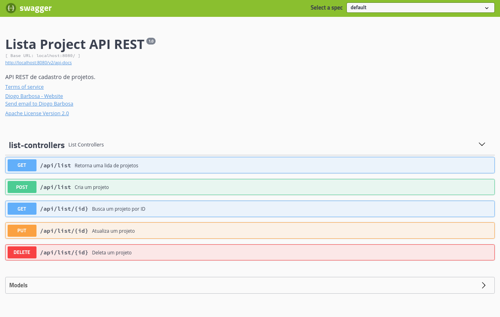

<div>
  <h1 align="center">LIST_PROJECT</h1>
  
  <div align="center">

  <a href="#sobre">Sobre</a> 
    |
  <a href="#tecnologias">Tecnólogias</a>
    |
  <a href="#dependencias">Utilizar projeto</a>
    |
  </div>
</div>

<div >
<ul align="center">
  
  
</ul>

</div>


<div>
  <h3>Sobre.</h3>
  <h4 id="sobre">
  <b>Desenvolvido com SPRING,</b>
    APi da aplicação de List project, onde o mesmo utiliza de um banco local para armazenamento de projetos da aplicação.</h4>

  
</div>


<div id="tecnologias">
  <h3>Tecnológias.</h3>
  <ul>
    <li>
      <a href="https://spring.io/">
      SPRING
      </a>
    </li>
    <li>
      <a href="https://www.h2database.com/html/main.html">
        H2.
      </a>
    </li>
    <li>
      <a href="https://www.java.com/pt-BR/">
        JAVA.
      </a>
    </li>
    <li>
      <a href="https://maven.apache.org/">
        MAVEN
      </a>
    </li>
  </ul>
  
</div>

<div id="dependencias">

<h3>Baixar Projeto.</h3>  

```bash
# Clone this repository
$ git clone https://github.com/FullBarbosa/DT_money.git DtMoney
```

<p>Para utilizar o projeto é necessario ter o java 11 instalado na maquina, dessa forma ao executar o arquivo na Ide, o maven baixará todas as dependecias necessarias</p>
